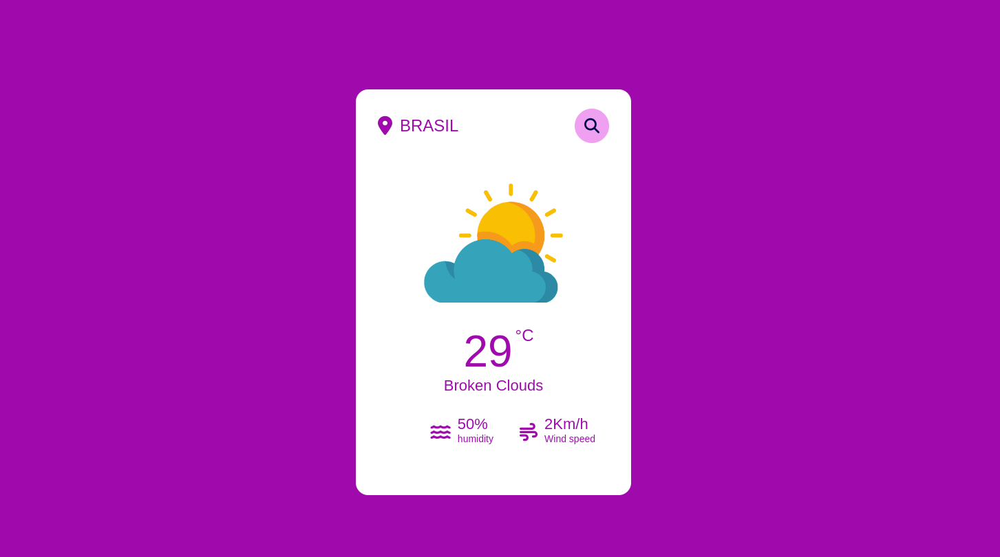

# Aplicativo de Previsão do Tempo

Este é um aplicativo de previsão do tempo que utiliza tecnologias web como HTML, CSS e JavaScript, juntamente com a integração da API do OpenWeather.

# Tecnologias utilizadas
+ HTML: Linguagem de marcação utilizada para estruturar a página web. 
+ CSS: Linguagem de estilização utilizada para definir o layout e o estilo visual da página. 
+ JavaScript: Linguagem de programação utilizada para criar a lógica do aplicativo e interagir com os elementos da página. 
+ API do OpenWeather: É uma API de serviço de previsão do tempo que fornece dados meteorológicos precisos e atualizados.  
# Funcionalidades

Exibição da previsão do tempo atual para uma localização específica. 
Exibição da temperatura atual, descrição do tempo, velocidade do vento e umidade. 
Possibilidade de buscar a previsão do tempo para diferentes cidades. 
Utilização de ícones ilustrativos para representar o estado do tempo. 
Responsividade: o aplicativo se adapta a diferentes dispositivos e tamanhos de tela. 

## Como utilizar
Clone ou faça o download deste repositório. 
Abra o arquivo index.html em um navegador web compatível. 
Digite o nome da cidade desejada na barra de pesquisa e pressione Enter. 
A previsão do tempo para a cidade especificada será exibida na tela. 

## Notas
Certifique-se de ter uma conexão com a internet para que a API do OpenWeather funcione corretamente.
Os dados de previsão do tempo são fornecidos pela API do OpenWeather e podem estar sujeitos a variações ou indisponibilidades. 
Esperamos que este aplicativo de previsão do tempo seja útil e lhe proporcione informações precisas sobre as condições meteorológicas em diferentes cidades. Sinta-se à vontade para contribuir para este projeto e melhorar suas funcionalidades!

[Link do App!](https://vanessamachado93.github.io/app-weather/)

